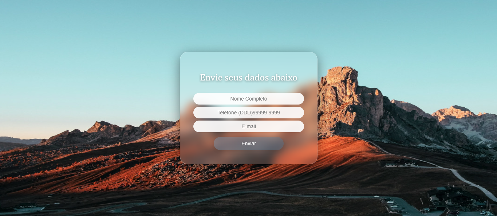
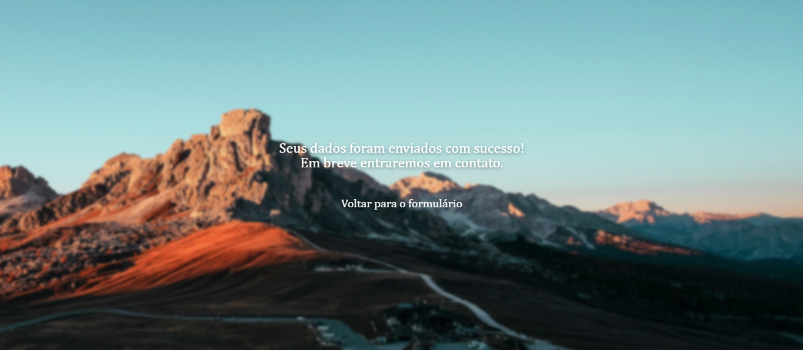

<h1 align="center"><strong>GlassForm — Formulário com Fundo Animado</strong></h1>

    <strong>Este é um projeto de estudo 👩🏻‍💻</strong> 
    Formulário moderno desenvolvido com HTML, CSS e JavaScript, utilizando
    efeito <em>glassmorphism</em>, fundo animado e formatação automática de telefone.

    
    

    <a href="https://nathaliabaes.github.io/form/">📱 Acesse este Projeto</a>

